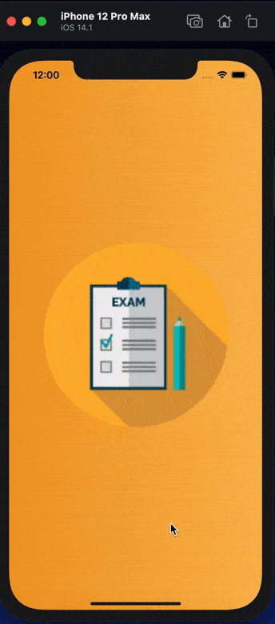
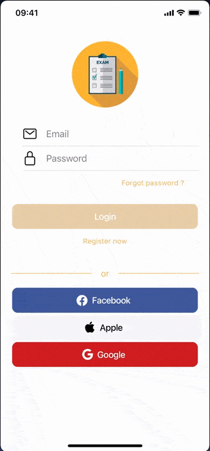
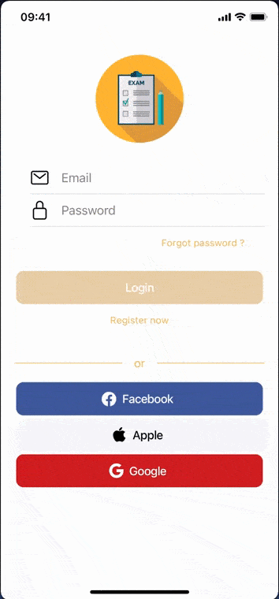
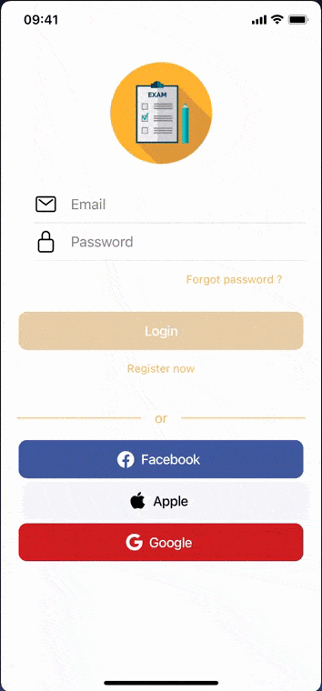
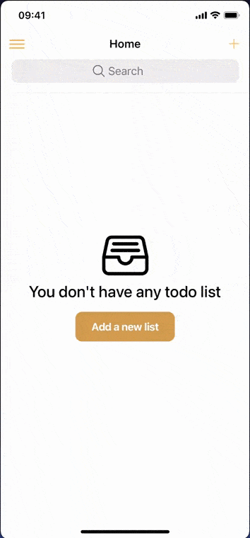
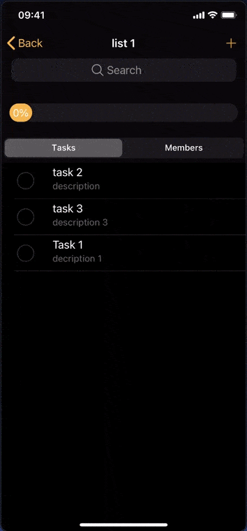
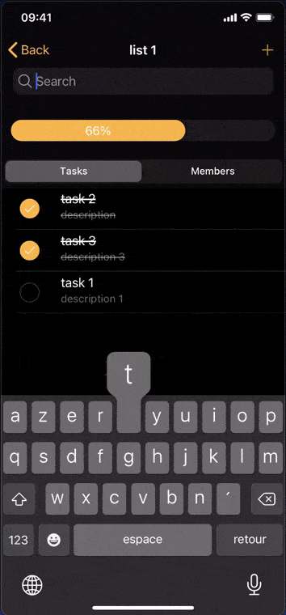
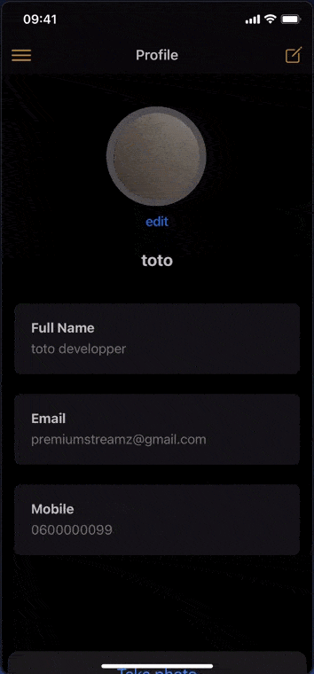
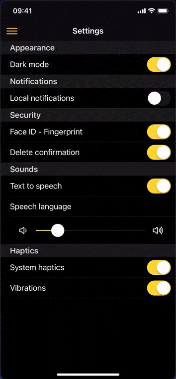
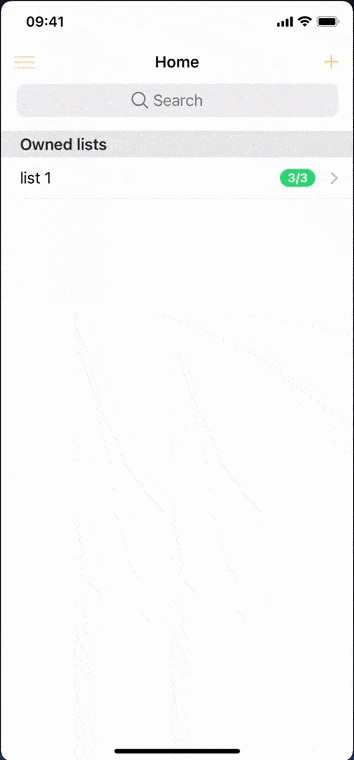

<h1 align=center> Firetask : a shared todolist PWA</h1>

<p align=center>
  
  
  
  
</p>

## Summary 
- [Installation](#installation)
    - [Requirements](#req)
    - [Running](#run)	
- [Application preview](#app)
- [Basic features](#basic)
- [Advanced features](#advanced)
    - [UI](#ui)
    - [Settings](#settings)
    - [Profile](#profile)
    - [Lists and Tasks](#lists)
    - [Others](#others)
- [Plugins used](#plugin)
    - [Mapbox](#map)
    - [Capacitor official plugins](#cap)
    - [Capacitor community plugins](#cap-com)


<span id="installation"></span>
## 1 - Installation
<span id="req"></span>
### Requirements
```sh
npm install -g @angular/cli
npm install -g ionic
npm install @capacitor/core @capacitor/cli

```
<span id="run"></span>
### Running
```sh
git clone https://github.com/chouaibMo/ionic-todolist-app.git
cd todoList
npm install 
ionic serve
```

<span id="app"></span>
## 2 - Preview
### Live demo
### [&nbsp;&nbsp;&nbsp;click here](https://todolist-app-e908c.firebaseapp.com) &nbsp;&nbsp;or&nbsp;&nbsp; [here](https://todolist-app-e908c.web.app)
    

### First launch
<p> 
  
</p>

### Login/Register
<p> 
  
  
  
</p>

### Lists/Tasks
<p> 
  
  
  
</p>

### Others (profile, settings ...)
<p> 
  
  
  
</p>

<span id="basic"></span>
## 3 - Basic features 
    - Email sign in and registration
    - Email verification
    - Password recovery
    - Google authentication
    - Facebook authentication
    - Form errors validation
    - Form errors handling (with toasts)
    - Firestore security rules
    - Create/Delete a list
    - Create/Delete a task
    - searchbar for lists and tasks
    - Share lists (permissions : readonly, read and write, share)
    - List progress with animation
    - Profile page : show & update user informations
    - Settings page : enable/disable provided functionalities
    - Routing guards

<span id="advanced"></span>
## 4 - Advanced features 
<span id="ui"></span>
### UI :
    - Progressive web app 
    - Erogonomic UX/UI design
    - Custom first launch tutorial 
    - Custom application icon
    - Custom plashScreen (splash-screen plugin)
    - Status bar updated when mode changes (dark/light)
    - Show toast when network status changes (network plugin)
    - Loading indicator (spinner) during auth operations 


<span id="settings"></span>
### Settings :
    - Enable/disable dark mode
    - Enable/disable delete confirmation (for lists and tasks)
    - Enable/disable Haptics/Vibrations (haptics plugin)
    - Enable/disable text to speech (text-to-speech plugin)
    - Select speech speed (text-to-speech plugin)
    - Select speech language (supported only on web platform, english for iOS and Android)
    - Settings stored in local storage (local storage plugin)
	
<span id="profile"></span>	
### Profile :
    - Update user information.
    - Update user picture : take picture - choose from galery - remove (camera plugin + action-sheet)

<span id="lists"></span>
### Lists and Tasks :
    - Offline mode (create/delete lists or tasks)
    - Show contributors (readers and writers) of each list
    - Add tasks with address ( address search bar with autocompletion)
    - Cast address to long/lat using geocoding (mapbox package)
    - Speak if text-to-speech enabled in settings (text-to-speech plugin)
    - Show address in a mapbox with a marker (if address provided in task)
    - Show user localisation if available (geolocation plugin)

<span id="others"></span>
### Others :
    - Call members with provided phone number (call-number plugin)
    - Open in-app browser (browser plugin)
    - Share message with other apps (share plugin)

<span id="plugin"></span>
## 5 - Plugins used :
<span id="map"></span>
### Mapbox ([mapbox](https://github.com/mapbox))
    - ✅ mapbox-gl-js
    - ✅ mapbox-gl-directions
    
<span id="cap"></span>    
### Capacitor official plugins ([capacitor-plugins](https://github.com/ionic-team/capacitor-plugins))
    - ✅ @ionic/pwa-elements
    - ✅ @capacitor/storage 
    - ✅ @capacitor/local-notifications    
    - ✅ @capacitor/share                         
    - ✅ @capacitor/camera                      
    - ✅ @capacitor/network  
    - ✅ @capacitor/haptics
    - ✅ @capacitor/geolocation               
    - ✅ @capacitor/browser                    
    - ✅ @capacitor/action-sheet      
    - ✅ @ccapacitor/splash-screen
    - ✅ @capacitor/status-bar
    - ✅ @ionic-native/call-number
    - 🆘 capacitor-biometric-auth (Not working)


<span id="cap-com"></span>
### Capacitor community plugins ([capacitor-community](https://github.com/capacitor-community))
    - ✅ @capacitor-community/text-to-speech      
    - ✅ @capacitor-community/facebook-login  